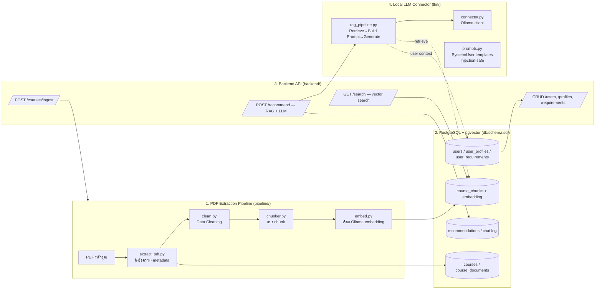

# Course Advisor System / Course Compass

ระบบแนะนำหลักสูตร (course) ให้ผู้ใช้ โดยอ่านข้อมูลจาก PDF หลักสูตร, จับคู่กับ Profile/Requirement
ของผู้ใช้ ผ่าน Vector Search + Local LLM (Qwen/Llama รันผ่าน [Ollama](https://ollama.com))

Frontend ชื่อ **Course Compass** สร้างด้วย Next.js + React + TypeScript + Tailwind รองรับสมัคร/เข้าสู่ระบบ แบบสอบถาม รายการหลักสูตร และหน้าที่ปรึกษา AI แบบ responsive

## สมมติฐาน / ทางเลือกที่เลือกให้ (แก้ไขได้ภายหลัง)

| หัวข้อ | ทางเลือกที่ใช้ | เหตุผล |
|---|---|---|
| Backend | **FastAPI** (Python) | ใช้ภาษาเดียวกับ PDF pipeline และ LLM ecosystem (Ollama/LangChain ส่วนใหญ่เป็น Python) ลดความซับซ้อนของทีมและ deployment |
| Database | **PostgreSQL + pgvector** | เก็บทั้งข้อมูลเชิงสัมพันธ์ (user/course/requirement) และ vector embedding ไว้ที่เดียว ลด moving parts เทียบกับ vector DB แยก (Qdrant/Milvus) — ถ้า scale ใหญ่มากค่อยย้ายภายหลังได้ เพราะ schema ออกแบบให้ decouple ผ่าน service layer อยู่แล้ว |
| Local LLM runtime | **Ollama** serving Qwen2.5 / Llama 3.x | รองรับทั้ง chat completion และ embedding endpoint ในตัวเดียว, ติดตั้งง่ายบนเครื่อง local/on-prem |
| Embedding model | `nomic-embed-text` (768 dim) ผ่าน Ollama, ปรับ dim ได้ที่ `EMBED_DIM` | โมเดล embedding ที่รันบนเครื่องเดียวกับ LLM ได้ ไม่ต้องพึ่ง external API |

## Data Flow



**สรุป flow การแนะนำหลักสูตร (recommend):**
1. ผู้ใช้เรียก `POST /recommend` พร้อม `user_id`
2. API ดึง `user_profiles` + `user_requirements` จาก DB
3. แปลง requirement เป็น query text → เรียก embedding model → vector search บน `course_chunks`
4. นำ top-k chunks (พร้อมอ้างอิง course/page) + profile ไปประกอบ prompt ผ่าน `prompts.py`
5. ส่งไปยัง Local LLM (Qwen/Llama ผ่าน Ollama) เพื่อสรุปเหตุผลและจัดอันดับหลักสูตร
6. บันทึกผลลัพธ์ลง `recommendations` เพื่อ audit/ปรับปรุงภายหลัง

## โครงสร้างโฟลเดอร์

```
course-advisor-system/
├── db/schema.sql              # ตาราง PostgreSQL + pgvector
├── backend/                   # FastAPI app
│   └── app/{core,db,models,schemas,api,services}
├── pipeline/                  # PDF extraction + cleaning + chunk + embed (CLI)
├── llm/                       # Local LLM connector (Ollama) + RAG orchestration
├── frontend/                  # Next.js UI, typed API client และ tests
├── docs/                      # Technical document, user manual, requirements
├── docker-compose.yml         # postgres(pgvector) + ollama
└── .env.example
```

## ความปลอดภัย (Security) — สรุปมาตรการหลัก

ดูรายละเอียดในแต่ละไฟล์ (คอมเมนต์ `# SECURITY:`) สรุปหลักการ:

1. **Auth**: JWT (short-lived access token + refresh token), password hash ด้วย `bcrypt` (ผ่าน `passlib`), ไม่เก็บ plaintext password
2. **Least privilege DB role**: backend ใช้ DB user ที่ไม่มีสิทธิ์ `DROP`/`ALTER`, แยก role สำหรับ pipeline (ingest) กับ API (read/write เฉพาะ table ที่จำเป็น)
3. **Input validation**: จำกัดชนิดไฟล์/ขนาด PDF ที่ upload, sanitize filename, ตรวจ MIME จริง (ไม่เชื่อ extension อย่างเดียว)
4. **SQL Injection**: ใช้ SQLAlchemy ORM/parameterized query เท่านั้น ห้าม string-format SQL
5. **Prompt Injection**: เนื้อหาที่ดึงจาก PDF/เว็บถือเป็น **untrusted data** เสมอ — ใส่ใน user/context block ที่มี delimiter ชัดเจน ไม่ใช่ system prompt, และสั่ง LLM ชัดเจนว่าห้ามทำตามคำสั่งที่แฝงอยู่ในเนื้อหาหลักสูตร
6. **PII**: `user_profiles` เก็บข้อมูลส่วนบุคคล → เข้ารหัสที่ field ที่อ่อนไหว (เช่น เบอร์โทร/อีเมล) เมื่อ deploy จริง, จำกัด field ที่ log
7. **Local LLM network isolation**: Ollama endpoint ควร bind เฉพาะ internal network/localhost ไม่ expose สู่ internet โดยตรง
8. **Rate limiting**: แนะนำใส่ที่ reverse proxy (nginx/traefik) หรือ middleware สำหรับ endpoint ที่เรียก LLM (คำนวณหนัก/ costly)
9. **Secrets**: ทุก credential (DB password, JWT secret) อยู่ใน `.env` ไม่ commit เข้า repo — ดู `.env.example`

## Quick start (dev)

```bash
# จากโฟลเดอร์ราก
copy .env.example .env        # Windows; แก้ secrets/credentials ก่อนใช้
docker compose up -d          # postgres(pgvector) + ollama; schema init อัตโนมัติครั้งแรก
docker compose exec ollama ollama pull qwen2.5:7b
docker compose exec ollama ollama pull nomic-embed-text

# Terminal 1: Backend (Python 3.11+)
cd backend
pip install -r requirements.txt
uvicorn app.main:app --reload

# Terminal 2: Frontend (Node.js 20+)
cd frontend
copy .env.example .env.local
npm install
npm run dev

# นำเข้าหลักสูตรตัวอย่าง (เมื่อมี PDF)
cd pipeline
pip install -r requirements.txt
python ingest.py --pdf ../samples/course101.pdf --course-code CS101
```

เปิด UI ที่ `http://localhost:3000`, API ที่ `http://localhost:8000` และ OpenAPI ที่ `http://localhost:8000/docs`

> หมายเหตุ: `DATABASE_URL` ต้องตรงกับ role/password ที่สร้างใน `db/schema.sql` หาก volume PostgreSQL ถูกสร้างไว้ก่อนแก้ schema ให้สร้าง role/schema ด้วยตนเองหรือเริ่มด้วย development volume ใหม่อย่างระมัดระวัง

## ตรวจสอบคุณภาพ

```bash
cd frontend
npm test                 # unit + integration tests
npm run build            # type check และ production build

curl http://localhost:8000/health
```

การทดสอบ Frontend mock HTTP boundary จึงไม่ต้องเปิด Backend ส่วนการทดสอบระบบจริงต้องเปิด PostgreSQL, Ollama และ FastAPI พร้อมข้อมูลหลักสูตรที่ ingest แล้ว

## เอกสาร

- [Technical Document](docs/TECHNICAL_DOCUMENT.md) — architecture, data flow, API, security และข้อจำกัด
- [User Manual](docs/USER_MANUAL.md) — วิธีสมัคร กรอกแบบสอบถาม และใช้ Chatbot
- [Requirement Document](docs/REQUIREMENTS.md) — functional/non-functional requirements และ acceptance criteria

## การตั้งค่า

| ตัวแปร | ฝั่ง | ค่าเริ่มต้น/หน้าที่ |
|---|---|---|
| `DATABASE_URL` | Backend/Pipeline | PostgreSQL connection string |
| `JWT_SECRET` | Backend | secret สำหรับลงนาม token; ต้องสุ่มใหม่ |
| `OLLAMA_BASE_URL` | Backend/Pipeline | `http://127.0.0.1:11434` |
| `LLM_MODEL` / `EMBED_MODEL` | Backend | โมเดล generation/embedding |
| `CORS_ALLOW_ORIGINS` | Backend | ต้องมี origin ของ Frontend |
| `NEXT_PUBLIC_API_URL` | Frontend | `http://localhost:8000` |
# Project-Chataipnru
