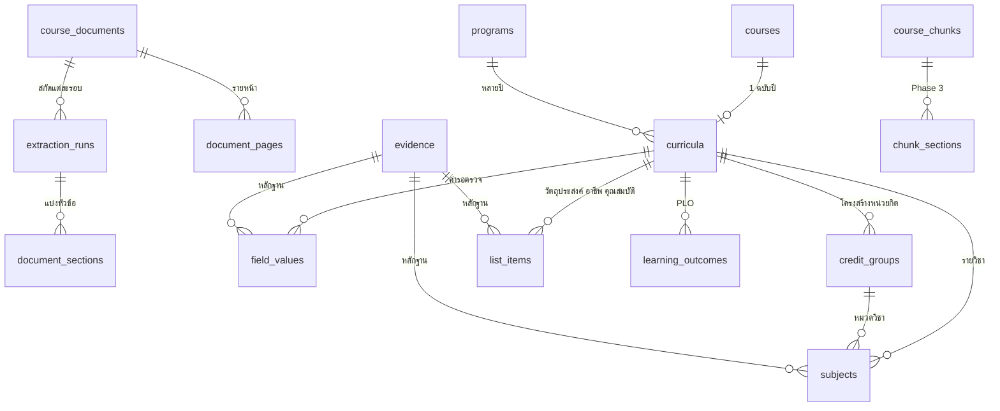
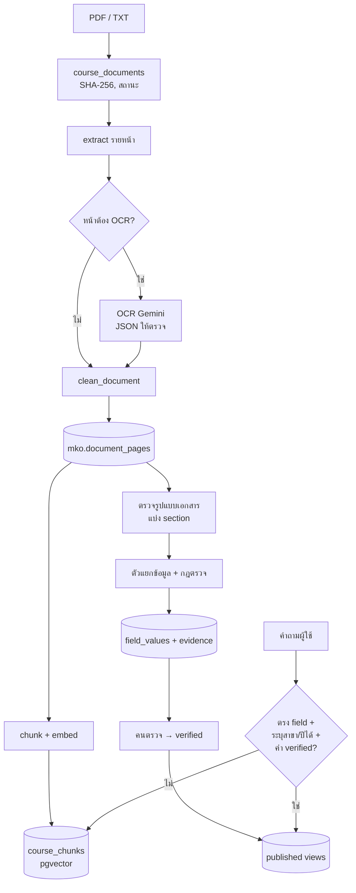

# ออกแบบระบบข้อมูลหลักสูตร มคอ. แบบ Hybrid (Structured Database + RAG)

| | |
|---|---|
| โครงการ | SCI Advisor — คณะวิทยาศาสตร์และเทคโนโลยี มหาวิทยาลัยราชภัฏพระนคร |
| วันที่ | 15 ก.ย. 2569 |
| สถานะ | **ร่างเพื่อขออนุมัติ** — ยังไม่ได้แก้ code, database หรือ deploy |
| ขอบเขต | ANALYZE + DESIGN + PLAN เท่านั้น |
| ระบบที่ใช้งานอยู่ | commit `b78b3f8` บน production |

---

## สารบัญ

- [สรุปข้อเสนอ](#สรุปข้อเสนอ)
- [ข้อเท็จจริงจากระบบจริงที่มีผลต่อการออกแบบ](#ข้อเท็จจริงจากระบบจริงที่มีผลต่อการออกแบบ)
- [A. การนำเข้าเอกสารปัจจุบันทำงานอย่างไร](#a-การนำเข้าเอกสารปัจจุบันทำงานอย่างไร)
- [B. ส่วนของระบบเดิมที่ reuse ได้](#b-ส่วนของระบบเดิมที่-reuse-ได้)
- [C. Database Schema ที่ควรเพิ่ม](#c-database-schema-ที่ควรเพิ่ม)
- [D. Template ของ มคอ.](#d-template-ของ-มคอ)
- [E. Data Flow](#e-data-flow)
- [F. เมื่อไหร่ใช้ PostgreSQL เมื่อไหร่ใช้ RAG](#f-เมื่อไหร่ใช้-postgresql-เมื่อไหร่ใช้-rag)
- [G. Migration โดยไม่ทำข้อมูลเดิมพัง](#g-migration-โดยไม่ทำข้อมูลเดิมพัง)
- [H. ความเสี่ยงและจุดที่ต้องระวัง](#h-ความเสี่ยงและจุดที่ต้องระวัง)
- [Implementation Plan](#implementation-plan)
- [เรื่องที่ต้องตัดสินใจก่อนเริ่ม](#เรื่องที่ต้องตัดสินใจก่อนเริ่ม)

---

## สรุปข้อเสนอ

อาจารย์เสนอว่าไม่ควรพึ่งการอ่าน PDF + RAG อย่างเดียว แต่ควรเก็บข้อมูลใน มคอ. เป็นโครงสร้างที่อ่านค่าแน่นอนจาก PostgreSQL ได้โดยตรง ข้อเสนอในเอกสารนี้คือ

- **เพิ่มชั้นข้อมูลเชิงโครงสร้างใน schema ใหม่ชื่อ `mko`** ต่อจากระบบเดิม แบบเพิ่มอย่างเดียว ไม่แก้หรือลบตารางเดิม
- **สกัดข้อมูลจากข้อความรายหน้า** ด้วยตัวแยกข้อมูลที่อิงหัวข้อของ มคอ. ไม่ให้ AI สร้างค่าขึ้นเอง
- **ทุกค่าตรวจย้อนได้** มีไฟล์ หน้า ข้อความที่ยกมา และสถานะกำกับ ค่าที่หาไม่เจอหรือไม่มั่นใจเป็น `NULL` / `needs_review`
- **แชทตอบจาก PostgreSQL ก่อน** เฉพาะคำถามที่ตรงกับ field และค่านั้นผ่านการตรวจแล้ว นอกนั้นใช้ RAG + pgvector เดิม
- **ไม่แตะ `course_chunks`** (9,039 chunk และ embedding ทั้งหมด) และไม่กระทบ production จนกว่าจะอนุมัติทีละขั้น

---

## ข้อเท็จจริงจากระบบจริงที่มีผลต่อการออกแบบ

ตรวจจาก codebase และ query production แบบอ่านอย่างเดียวเมื่อ 14–15 ก.ย. 2569

| เรื่อง | สิ่งที่พบ | ผลต่อการออกแบบ |
|---|---|---|
| ไฟล์ต้นทาง | ไฟล์ใน `samples/` ตรงกับ production ครบ 31/31 ไฟล์ (SHA-256 เท่ากัน) | ทดลองสกัดข้อมูลบนเครื่อง local ได้โดยไม่แตะเซิร์ฟเวอร์ |
| ผล OCR เดิม | ยังอยู่ที่ `~/course-advisor-system/eval/ocr_pages.json` บนเซิร์ฟเวอร์ 186 หน้า จาก 18 ไฟล์ | ไม่ต้องเสียโควตา OCR ใหม่ |
| รูปแบบ มคอ. | มีสองรุ่นที่หัวข้อต่างกันมาก: แบบ TQF เดิม หมวด 1–8 (เช่น "หมวด 3 ระบบการจัดการศึกษา การดำเนินการ และโครงสร้างของหลักสูตร") และแบบเกณฑ์ 2565 หมวด 1–9 (agri68: "หมวด 3 โครงสร้างหลักสูตร รายวิชา และหน่วยกิต", "หมวด 6 คุณสมบัติของผู้เข้าศึกษา", "หมวด 9 ระบบกลไกของการพัฒนาหลักสูตร") | ต้องมี template หลายแบบ และตรวจรูปแบบจากหัวข้อ |
| เอกสารแบบอื่น | ใบสรุปหลักสูตร (`*_brief`, `ma69`) ไม่มีคำว่า "หมวด" เลย และ `ph_web.txt` เป็นข้อความจากหน้าเว็บ | template แยกอีกสองแบบ |
| หัวข้อหลอก | คำว่า "หมวดที่ 1–11" โผล่ในภาคผนวกด้วย (ข้อบังคับมหาวิทยาลัย เช่น การลงทะเบียน อาจารย์ที่ปรึกษา) และในหน้าสารบัญ | ต้องตัดสารบัญและภาคผนวกก่อนแบ่ง section |
| ค่าซ้ำหลายที่ | `atm.pdf` มี "จำนวนหน่วยกิตรวม" 6 หน้า รวมภาคผนวก 7 ที่เป็นตารางเปรียบเทียบกับหลักสูตรเดิม พ.ศ. 2560/2561 และ `ma64` มีทั้งหน้า 6, 16, 139 | เลือกค่าจากตำแหน่งตาม template ไม่ใช่ค่าที่เจอก่อน |
| ข้อมูลโครงสร้างที่มีตอนนี้ | `program_facts.json` เก็บคณิตศาสตร์ 130 หน่วยกิตค่าเดียวไม่แยกปี ตรงกับ `ma64` หน้า 6 แต่ `ma69` หน้า 1 ระบุ 124 | ข้อมูลปนปีกันอยู่แล้ว ระบบใหม่ต้องแยกฉบับปีตั้งแต่ระดับโครงสร้าง |
| ตารางรายวิชา | ข้อความถูกแตกเป็นหลายบรรทัด: รหัส 7 หลัก / ชื่อไทย / ชื่ออังกฤษ / `3(3-0-6)` คนละบรรทัด (`cs66` หน้า 13, `cs61` หน้า 30) และรหัสขึ้นต้นด้วย 0 ได้ เช่น `0010102` | ต้องมีตัวแยกระเบียนหลายบรรทัด และเก็บรหัสเป็น text |
| ข้อความเพี้ยน | "ระบบกำรจัดกำรศึกษำ", "ไม่น้อยกว่ำ" ใน `ma64`, `bio2568`, `en65` ซึ่ง `clean.py` ยังไม่แก้ | เทียบหัวข้อแบบ normalize และตั้งค่าที่ดูเพี้ยนเป็น `needs_review` |
| PLO | มีเฉพาะบางเล่ม (`attm65` หน้า 13, `bio2568`, `agri68`) เล่ม TQF เดิมใช้มาตรฐานผลการเรียนรู้ | กรณีไม่มีหัวข้อต้องเป็น `not_applicable` ไม่ใช่ "หาไม่เจอ" |
| เอกสารไม่ครบ | `cs66.pdf` มีแค่ 55 หน้า ผูกกับ `cs66_brief.pdf` ใน `courses` เดียวกัน | ต้องมีลำดับความน่าเชื่อถือของเอกสาร |

---

## A. การนำเข้าเอกสารปัจจุบันทำงานอย่างไร

การนำเข้าเป็นคำสั่งรันแบบ offline ไม่มี endpoint ให้อัปโหลด ([courses.py](../backend/app/api/routes/courses.py) เขียนเหตุผลไว้ว่างานหนักไม่ควรทำใน HTTP request)

| ขั้น | ไฟล์ | ทำอะไร |
|---|---|---|
| 1. เลือกไฟล์และตั้งชื่อ | [ingest_batch.py](../pipeline/ingest_batch.py) | อ่านชื่อหลักสูตรจาก `titles.json` และรหัสจาก `codes.json` ที่กรอกเอง ปีหลักสูตรมีอยู่แค่ในข้อความชื่อ เช่น "(พ.ศ. 2566)" |
| 2. ดึงข้อความ | [extract_pdf.py](../pipeline/extract_pdf.py) | PyMuPDF อ่านทีละหน้า ตรวจ magic bytes จำกัดขนาด 50MB ไม่รับไฟล์เข้ารหัส และรับ `.txt` โดยแบ่งหน้าตามบรรทัดว่าง |
| 3. OCR | [ocr.py](../pipeline/ocr.py) | รันแยกก่อน เลือกหน้าที่มีข้อความน้อยกว่า 200 ตัวอักษรและมีภาพ แปลงเป็นภาพ 200 DPI ส่ง Gemini ด้วยคำสั่งห้ามเดา ผลเก็บเป็น JSON ให้ตรวจก่อน แล้ว `apply_ocr` ต่อท้ายข้อความของหน้านั้น |
| 4. ทำความสะอาด | [clean.py](../pipeline/clean.py) | แก้อักขระไทยใน PUA, สระอำที่แตก, อักขระควบคุม, ตัด header/footer ที่ซ้ำเกิน 60% ของหน้า |
| 5. แบ่ง chunk | [chunker.py](../pipeline/chunker.py) | 1,000 ตัวอักษร ซ้อน 150 แบ่งภายในหน้าเดียว เก็บเลขหน้าไว้ |
| 6. Embedding | [embed.py](../pipeline/embed.py) | bge-m3 ผ่าน Ollama ได้ 1,024 มิติ เรียกทีละ chunk |
| 7. บันทึก | [ingest.py](../pipeline/ingest.py) | ใช้บัญชี `advisor_ingest` ตรวจ SHA-256 ก่อนทำ embedding สร้างแถว `courses` และ `course_documents` แล้ว transaction ลบและใส่ chunk ใหม่ ถ้าล้มจะบันทึกสถานะ failed |
| 8. ค้นตอนตอบ | [vector_search.py](../backend/app/services/vector_search.py), [course_scope.py](../backend/app/services/course_scope.py), `chat._retrieve` | หาสาขาและปีจากชื่อหรือคำย่อ ถ้ากรองสาขาจะปิด index แล้วค้นด้วย cosine ทั้งชุด จากนั้นตรวจหลักฐานด้วย LLM แล้วตอบพร้อมเลขหน้า |

ข้อสังเกตเพิ่มเติม

- **แถวใน `courses` คือ "หลักสูตร 1 ฉบับปี"** ไม่ใช่รายวิชา (24 แถว, 31 ไฟล์)
- **`course_chunks.metadata` ว่างทุกแถว**
- **ข้อมูลเชิงโครงสร้างตอนนี้อยู่ในไฟล์ JSON ที่ทำด้วยมือ:** `program_facts.json` (หน่วยกิต, ภาษา), `program_about.json`, `programs_offered.json`, `tuition.json`
- **ไม่มีเครื่องมือ migration** — `db/schema.sql` รันแค่ครั้งแรกที่ volume ของ Postgres ยังว่าง

---

## B. ส่วนของระบบเดิมที่ reuse ได้

| Reuse ได้ทันที | Reuse โดยต่อยอด | Reuse เป็นแนวทาง |
|---|---|---|
| `extract_document`, `pages_needing_ocr`, `render_page`, `ocr_image`, `UNREADABLE`, `apply_ocr`, `clean_document` — ใช้สร้างข้อความรายหน้าชุดเดียวกับที่ใช้ทำ chunk | `ingest.py` เพิ่มขั้นสกัดข้อมูลหลังบันทึก chunk เสร็จ ใน transaction แยก ถ้าขั้นนี้ล้ม chunk ไม่เสีย | `program_compare.py` ที่ให้ LLM สรุปทีละเล่ม: ใช้แนวคิดเดียวกัน แต่ต้องย้ายมาทำ offline และต้องมีข้อความที่ยกมาเป็นหลักฐาน |
| SHA-256, สถานะ document, บัญชี `advisor_ingest` | `program_match._looks_like_table_of_contents` ย้ายไปโมดูลกลางเพื่อตัดหน้าสารบัญ | `_core_rows` ที่หาหัวข้ออาชีพหรือวัตถุประสงค์ด้วย LIKE คือตัวแบ่ง section แบบง่าย |
| `course_scope` (หาสาขา, คำย่อ, ปี), `_context_programme`, `query_expansion` | `course_scope._year_in` เพิ่มการแปลง ค.ศ. เป็น พ.ศ. | `tuition.py` คือตัวอย่างการตอบจากข้อมูลแน่นอนโดยไม่ผ่านโมเดล พร้อมระบุที่มา |
| ด่านตรวจหลักฐานและ RAG เดิมทั้งหมด | `answer_cache.corpus_version` ให้รวมรุ่นของข้อมูลเชิงโครงสร้างด้วย | `scripts/backup_db.sh` ใช้ก่อน migration |

---

## C. Database Schema ที่ควรเพิ่ม

แยก schema ใหม่ชื่อ `mko` และเพิ่มอย่างเดียว ไม่ ALTER หรือ DROP ตารางเดิม

- **แยกขาดจากตารางเดิม** ถ้าต้องย้อนกลับ ลบแค่ `DROP SCHEMA mko CASCADE`
- **ไม่ชนชื่อกับ `courses`** ซึ่งหมายถึงหลักสูตร ไม่ใช่รายวิชา

### ตาราง

| ตาราง | คอลัมน์หลัก | หน้าที่ |
|---|---|---|
| `mko.document_pages` | `document_id` (FK `course_documents`), `page_number`, `text_raw`, `text_clean`, `text_source` (`text_layer` / `ocr` / `text_layer+ocr` / `plain_text`), `is_toc`, `is_appendix`, `encoding_suspect` | ข้อความรายหน้าชุดเดียวกับที่ใช้ทำ chunk เป็น input ของตัวแยกข้อมูลและใช้อ้างอิงหน้า รันสกัดใหม่ได้โดยไม่ต้องทำ embedding ใหม่ |
| `mko.extraction_runs` | `document_id`, `parser_version`, `template_type`, `status`, `summary` | บันทึกการสกัดแต่ละรอบ ย้อนดูได้ว่าค่ามาจากตัวแยกข้อมูลรุ่นไหน |
| `mko.document_sections` | `run_id`, `document_id`, `section_key` (เช่น `general.careers`), `heading_text`, `page_start`/`page_end`, `offset`, `is_appendix` | ขอบเขตของแต่ละหัวข้อ |
| `mko.evidence` | `document_id`, `page_start`/`page_end`, `section_id`, `quote` (NOT NULL), `method` (`regex` / `table_parser` / `list_parser` / `llm_span` / `manual`) | หลักฐานของทุกค่า และ `quote` ต้องเป็นข้อความที่อยู่ในหน้านั้นจริง |
| `mko.programs` | `name_th`, `name_en`, `degree_level` (ตรี/โท/เอก), UNIQUE(`name_th`, `degree_level`) | ตัวตนของสาขาที่ข้ามปี |
| `mko.curricula` | `course_id` (UNIQUE, FK `courses`), `program_id`, `edition_year_be`, `revision_type`, `template_type`, `primary_document_id`, ชื่อปริญญาไทย/อังกฤษ/ย่อ, `total_credits`, `study_years`, `language`, `status` (`draft` / `in_review` / `published`); **UNIQUE(`program_id`, `edition_year_be`)** | 1 แถวต่อ 1 ฉบับปี ผูกกับ `courses` เดิม ปีจึงไม่ปนกันตั้งแต่ระดับโครงสร้าง ช่องแบบมีชนิดเติมตอน publish จากค่าที่ตรวจแล้วเท่านั้น |
| `mko.field_values` | `curriculum_id`, `run_id`, `field_key`, `value_text`/`value_int`, `status`, `reason`, `confidence`, `evidence_id`, `reviewed_by`/`reviewed_at` | ค่าที่สกัดได้ทุกค่าก่อนเผยแพร่ ใช้เป็นคิวให้คนตรวจ |
| `mko.credit_groups` | `curriculum_id`, `parent_id`, `seq`, `name_th`, `min_credits`, `evidence_id`, `status` | โครงสร้างหน่วยกิตเป็นลำดับชั้น (หมวด → กลุ่ม → กลุ่มย่อย) |
| `mko.subjects` | `curriculum_id`, `code` (text เก็บ 0 นำหน้า), `name_th`, `name_en`, `credits`, `hours_pattern` (`3(3-0-6)`), ชั่วโมงบรรยาย/ปฏิบัติ/ศึกษาเอง, `credit_group_id`, คำอธิบายไทย/อังกฤษ, `listing_evidence_id`, `description_evidence_id`, `status`; UNIQUE(`curriculum_id`, `code`) | รายวิชาในหลักสูตร |
| `mko.list_items` | `curriculum_id`, `item_type` (`philosophy` / `objective` / `career` / `admission`), `seq`, `text`, `evidence_id`, `status` | ข้อความที่เป็นรายการ เก็บตามต้นฉบับ |
| `mko.learning_outcomes` | `curriculum_id`, `framework` (`PLO` / `SubPLO` / `YLO` / `TQF_domain`), `code`, `parent_id`, `text`, `evidence_id`, `status` | PLO และมาตรฐานผลการเรียนรู้ |
| `mko.chunk_sections` (Phase 3) | `chunk_id` (FK `course_chunks`), `section_id` | ผูก chunk เดิมกับหัวข้อผ่านตารางกลาง ไม่ UPDATE 9,039 แถวเดิม |
| Views `mko.v_published_*` | กรองเฉพาะ `status = verified` และ `curricula.status = published` | สิ่งเดียวที่แชทอ่านได้ |

### ความสัมพันธ์



### สถานะของค่า

| สถานะ | ความหมาย |
|---|---|
| `candidate` | ผ่านการตรวจอัตโนมัติแล้ว |
| `needs_review` | ข้อมูลขัดกัน, มาจาก OCR, ข้อความเพี้ยน หรือความมั่นใจต่ำ |
| `verified` | ตรวจแล้ว เผยแพร่ได้ |
| `rejected` | ถูกปฏิเสธตอนตรวจ |
| `not_found` | ค้นในหัวข้อแล้วไม่เจอ ค่าเป็น NULL |
| `not_applicable` | รูปแบบเอกสารไม่มีหัวข้อนี้ เช่น PLO ในเล่ม TQF เดิม |

### สิทธิ์

- **`advisor_ingest`** เขียนได้ทุกตารางใน `mko`
- **`advisor_api`** อ่านได้เฉพาะ views
- **Migration** รันด้วยบัญชี `postgres`

---

## D. Template ของ มคอ.

แบ่งเป็น 4 รูปแบบเอกสาร และตรวจรูปแบบจากหัวข้อที่พบ ไม่ใช่จากปี เพราะ `attm65` เป็น TQF ที่เพิ่ม PLO เข้าไป

| `template_type` | ลักษณะ | ตัวอย่างในคลัง |
|---|---|---|
| `tqf2` | มคอ.2 แบบ TQF เดิม หมวด 1–8 | `cs61`, `it66`, `cos66`, `ma64`, `atm` |
| `std2565` | มคอ.2 ตามเกณฑ์ 2565 หมวด 1–9 | `agri68_master`, `agri68_phd` |
| `brief` | ใบสรุปหลักสูตร ไม่มีหมวด | `ma69`, `animation69`, `cook69`, `*_brief` |
| `web_page` | ข้อความจากหน้าเว็บคณะ | `ph_web.txt` |

### Section และ field

| Field | TQF (หมวด 1–8) | เกณฑ์ 2565 (หมวด 1–9) | วิธีสกัด | กฎตรวจก่อนรับค่า |
|---|---|---|---|---|
| ชื่อหลักสูตรไทย/อังกฤษ, ชื่อสาขา | หน้าปก, หมวด 1 ข้อ 1–2 | หมวด 1 | regex ในหัวข้อนั้น | ชื่อสาขาต้องตรงกับ `courses.title` เมื่อตัดคำนำหน้าแล้ว |
| ชื่อปริญญา/อักษรย่อ, ระดับการศึกษา | หมวด 1 ข้อ 2, 5.1 | หมวด 1 | regex (บัณฑิต / มหาบัณฑิต / ดุษฎีบัณฑิต) | ระดับที่ได้จากชื่อปริญญาต้องตรงกับข้อ 5.1 |
| ปีหลักสูตร | หน้าปก, ข้อ 6 "หลักสูตรปรับปรุง พ.ศ." | หมวด 1 | regex เฉพาะหน้าปกและหมวด 1 ไม่นับภาคผนวก | ต้องตรงกับปีใน `titles.json` ถ้าไม่ตรงเป็น `needs_review` |
| จำนวนหน่วยกิตรวม | หมวด 1 ข้อ 4 **และ** หมวด 3 ข้อ 3.1.1 | หมวด 1 และหมวด 3 | regex ตัดสารบัญและภาคผนวก | สองตำแหน่งต้องได้ค่าเท่ากัน ถ้าต่างหรือเจอที่เดียวเป็น `needs_review` |
| โครงสร้างหน่วยกิต | หมวด 3 ข้อ 3.1.2 | หมวด 3 | ตัวแยกรายการ "หมวด…/กลุ่ม… ไม่น้อยกว่า N หน่วยกิต" | ผลรวมระดับบนต้องเท่าหน่วยกิตรวม |
| ปรัชญา, วัตถุประสงค์ | หมวด 2 ข้อ 1.1, 1.3 | หมวด 2 | ตัวแยกรายการมีเลขข้อ เก็บข้อความตามต้นฉบับ | หยุดที่หัวข้อถัดไป ห้ามสรุปความ |
| คุณสมบัติผู้เข้าศึกษา | หมวด 3 ข้อ 2.2 | หมวด 6 | ตัดตามขอบเขตหัวข้อ | ไม่เอาข้อ 2.3 มาปน ซึ่งเป็นปัญหาที่ `program_compare.py` ยังมีอยู่ |
| PLO / Sub PLO / YLO | ถ้ามี เช่น หมวด 2 ข้อ 1.4 | หมวด 2 / 4 | regex `PLO n :` | ถ้าไม่มีหัวข้อนี้เป็น `not_applicable` |
| รายวิชา (รหัส, ชื่อไทย/อังกฤษ, หน่วยกิต, ชั่วโมง) | หมวด 3 ข้อ 3.1.3 และคำอธิบาย 3.1.5 | หมวด 3 | ตัวแยกระเบียนหลายบรรทัด: รหัส 7 หลัก → ชื่อไทย → ชื่ออังกฤษ → `n(l-p-s)` | หน่วยกิตต้องเท่าเลขตัวแรกของ pattern ข้อมูลในรายการกับคำอธิบายต้องตรงกัน ไม่เอาตารางเปรียบเทียบหลักสูตรเดิมและข้อบังคับในภาคผนวก |
| หมวดวิชาของรายวิชา | หัวข้อที่อยู่เหนือระเบียน | หมวด 3 | บริบทของหัวข้อ | ต้องอยู่ใน `credit_groups` ของฉบับเดียวกัน |
| อาชีพหลังสำเร็จการศึกษา | หมวด 1 ข้อ 8 | หมวด 1 | ตัวแยกรายการ | เก็บตามต้นฉบับ |
| ภาษา, การรับเข้า, สถานที่ | หมวด 1 ข้อ 5, 10 | หมวด 1 | regex | — |
| แหล่งข้อมูล | ทุก field | ทุก field | `evidence` (ไฟล์ หน้า ข้อความที่ยกมา วิธีสกัด) | ข้อความที่ยกมาต้องอยู่ในหน้านั้นจริง |

### นโยบาย AI

ใช้ LLM ได้เฉพาะเป็นตัวชี้ตำแหน่งข้อความ ภายในหัวข้อที่ตัดมาแล้ว

- **ต้องคืนข้อความที่ยกมาตรงตัว** และโค้ดต้องตรวจว่าข้อความนั้นอยู่ในหน้าจริง
- **ตัวเลขทุกตัวต้องมี regex ยืนยัน**
- **ถ้าไม่ผ่านทั้งสองข้อ** ให้เป็น `needs_review` แทนการเดา

---

## E. Data Flow

```
PDF / TXT
 → ลงทะเบียน course_documents (SHA-256, สถานะ)                        [เดิม]
 → extract รายหน้า → หาหน้าที่ต้อง OCR → OCR (Gemini, JSON ให้ตรวจ)       [เดิม]
 → clean_document                                                       [เดิม]
 → บันทึก mko.document_pages                                            [ใหม่]
 ├─ สาย RAG: chunk → embed → course_chunks                              [เดิม ไม่เปลี่ยน]
 └─ สายโครงสร้าง (รันซ้ำได้ ไม่ต้อง embed ใหม่):
     ตรวจรูปแบบเอกสาร → ตัดสารบัญ/ภาคผนวก → แบ่ง section
     → ตัวแยกข้อมูลแต่ละ field → กฎตรวจ (ค่าตรงกัน, ผลรวม, ปี, ข้อความยกมาอยู่ในหน้าจริง)
     → field_values + evidence (candidate / needs_review / not_found)
     → รายงานให้คนตรวจ (ค่า + หน้า + ข้อความยกมา) → verified
     → publish เป็น curricula / subjects / list_items / views
 → แชท: หา intent → หาสาขาและฉบับปี → ถ้ามีค่าที่ตรวจแล้ว ตอบจาก PostgreSQL พร้อม "มคอ.2 ไฟล์ หน้า"
         ถ้าไม่เข้าเงื่อนไข ไปทาง RAG เดิม
```



---

## F. เมื่อไหร่ใช้ PostgreSQL เมื่อไหร่ใช้ RAG

### ตอบจาก PostgreSQL เมื่อครบทุกข้อ

1. **คำถามตรงกับ field ที่รู้จัก** ตัดสินจากคำศัพท์ของคำถาม (หน่วยกิต, รายวิชา/รหัสวิชา, อาชีพ, คุณสมบัติ, PLO, วัตถุประสงค์) ไม่ใช่จากชื่อสาขา
2. **ระบุสาขาได้สาขาเดียว** จากคำถามหรือบทสนทนา ใช้ `course_scope` และ `_context_programme` เดิม
3. **ระบุฉบับปีได้**
   - ถ้าระบุปี (รวมถึงแปลง ค.ศ. เป็น พ.ศ.) ใช้ฉบับนั้นเท่านั้น
   - ถ้าไม่ระบุ ใช้ฉบับล่าสุดที่ publish แล้วและบอกปีในคำตอบ ถ้าฉบับอื่นค่าต่างกันให้แสดงทุกฉบับ
4. **ค่าของฉบับนั้นเป็น `verified`**
5. **ไม่ได้ขอให้อธิบาย เปรียบเทียบเนื้อหา หรือแนะนำสาขา**

คำตอบประกอบจากข้อมูลตรงๆ เหมือนคำตอบค่าเทอม ไม่ให้โมเดลเขียนตัวเลข

### ตัวอย่างการเลือกทาง

| คำถาม | ทาง | หมายเหตุ |
|---|---|---|
| "วิทยาการคอมพิวเตอร์มีกี่หน่วยกิต" | DB `total_credits` | มีฉบับ 2561 และ 2566 ถ้าไม่ระบุปีให้บอกปีที่ใช้ |
| "สาขานี้มีวิชาอะไรบ้าง" | DB `subjects` | สาขาจากบทสนทนา แสดงตามหมวดวิชาพร้อมจำนวนและหน้า |
| "มีวิชาเกี่ยวกับ AI ไหม" | DB ค้นชื่อและคำอธิบายรายวิชา (ใช้คำพ้องจาก `query_expansion`) | ถ้าเจอให้ระบุวิชา ถ้าไม่เจอให้ไปทาง RAG ตอบว่า "ไม่มี" ได้เฉพาะเมื่อฉบับนั้นตรวจแล้วว่ารายวิชาครบตามผลรวมหน่วยกิต |
| "จบแล้วทำอาชีพอะไรได้บ้าง" | DB `career` | แสดงรายการตามต้นฉบับ |
| อธิบายรายละเอียดหลักสูตร | RAG | — |
| เปรียบเทียบเนื้อหาหลายหลักสูตร | RAG | ใช้ด่านตรวจหลักฐานแบบเปรียบเทียบเดิม |
| แนะนำสาขาตามความสนใจ | `program_match` เดิม | — |
| คำถามที่ไม่มี field ตรงในฐานข้อมูล | RAG | — |
| field ยังไม่ `verified` หรือระบุสาขาไม่ได้ | RAG หรือถามกลับตามเดิม | ห้ามใช้ค่าของฉบับปีอื่นแทน |
| เปรียบเทียบสองสาขา | Hybrid | แถวหน่วยกิต/อาชีพ/คุณสมบัติจาก DB ส่วนบรรยายจาก RAG |

### ตำแหน่งใน `prepare_answer`

- **ต่อจากขั้นแนะนำสาขา สาขาที่ไม่มี และถามกลับว่าสาขาไหน** ก่อนเริ่มค้นเอกสาร
- **คำถามต่อเนื่องใช้คำถามที่ตีความแล้ว** แบบเดียวกับค่าเทอม

---

## G. Migration โดยไม่ทำข้อมูลเดิมพัง

1. **สำรองข้อมูลก่อน** ด้วย `scripts/backup_db.sh` แล้วทดลอง restore บนเครื่อง local ให้ผ่าน
2. **ทำงานบนเครื่อง local ทั้งหมด**
   - restore dump ลง Postgres ของ docker compose dev
   - สร้าง `document_pages` จาก `samples/` (hash ตรงแล้ว 31/31) และ `ocr_pages.json` ที่คัดลอกจากเซิร์ฟเวอร์
3. **Migration เป็นไฟล์ SQL มีเลขลำดับ** เช่น `db/migrations/001_mko_structured.sql`
   - `CREATE SCHEMA` / `CREATE TABLE IF NOT EXISTS` / GRANT ในรูปแบบรันซ้ำได้
   - มีตาราง `mko.schema_migrations` บันทึกว่ารันอะไรไปแล้ว
   - **ไม่มีคำสั่งแตะตาราง `public.*`**
4. **รันตัวแยกข้อมูลกับ 31 ไฟล์** วัดกับชุดคำตอบที่ตรวจด้วยมือ ตรวจค่าให้ครบ แล้ว publish บนเครื่อง local
5. **ขึ้น production (เมื่ออนุมัติ)**
   - สำรองอีกรอบ
   - รัน migration ซึ่งเพิ่มเฉพาะ schema `mko` (CREATE TABLE ไม่ lock ตารางเดิม)
   - นำเข้าเฉพาะค่าที่ตรวจแล้วด้วย `advisor_ingest`
6. **Deploy backend แบบ shadow ก่อน** (`STRUCTURED_ANSWERS=shadow`) คำนวณคำตอบจาก DB แล้วบันทึกเทียบกับคำตอบจริง แต่ยังไม่ส่งให้ผู้ใช้
7. **เปิดใช้ทีละ field** เมื่อผล shadow ผ่าน แล้วเพิ่มรุ่นแคช
8. **วิธีย้อนกลับ**
   - ปิด flag ได้ทันที
   - rollback image
   - ถ้าจำเป็น `DROP SCHEMA mko CASCADE` ซึ่ง `course_chunks`, embedding และ ivfflat ไม่ถูกแตะเลย
9. **ใช้ `program_facts.json` เป็นตัวสำรอง** จนกว่า DB จะตรวจครบ แล้วค่อยให้ `course-facts` อ่านจาก DB แยกตามปี ซึ่งจะแก้เคสคณิตศาสตร์ 130/124 ไปด้วย

---

## H. ความเสี่ยงและจุดที่ต้องระวัง

| ความเสี่ยง | วิธีรับมือ |
|---|---|
| รูปแบบเอกสาร 4 แบบ หัวข้อไม่ตรงกัน | ตรวจรูปแบบจากหัวข้อ มีชุดทดสอบของแต่ละแบบ รูปแบบที่ไม่รู้จักให้ทั้งเล่มเป็น `needs_review` |
| "หมวดที่" ในสารบัญและข้อบังคับในภาคผนวก | ตัดหน้าสารบัญ หาจุดเริ่มภาคผนวก เลือกหัวข้อที่เรียงลำดับถูกต้อง |
| ค่าซ้ำและขัดกัน (สารบัญ / หมวด 1 / หมวด 3 / ตารางเปรียบเทียบหลักสูตรเดิม / แผนการศึกษา) | เลือกจากตำแหน่งตาม template ต้องเจอค่าตรงกันสองแหล่ง ไม่ใช้ค่าที่เจอก่อน |
| ตารางถูกแตกบรรทัดหรือข้ามหน้า และการตัด header/footer อาจลบหัวตาราง | เก็บทั้ง `text_raw` และ `text_clean` ตัวแยกรายวิชาใช้ state machine และตรวจความถูกต้องทุกระเบียน |
| ข้อความเพี้ยนจากฟอนต์ ("กำร", "ไม่น้อยกว่ำ") | เทียบหัวข้อแบบ normalize ถ้าค่ามีรูปแบบเพี้ยนให้ตั้ง `encoding_suspect` เป็น `needs_review` ไม่แก้ข้อความเอง |
| ค่าที่มาจากหน้า OCR (186 หน้า ส่วนใหญ่อยู่ในภาคผนวก) | ต้องให้คนตรวจทุกค่า |
| ใบสรุปกับฉบับเต็มอยู่ใน `courses` เดียวกัน (`cs66.pdf` มีแค่ 55 หน้า + `cs66_brief`) | ลำดับความน่าเชื่อถือ ฉบับเต็ม > ใบสรุป > หน้าเว็บ ถ้าค่าต่างกันเป็น `needs_review` |
| ตอบว่า "ไม่มีวิชา X" ผิด เพราะสกัดรายวิชาไม่ครบ | ต้องมีตัวบ่งชี้ว่ารายวิชาครบ ถ้าไม่ครบให้ไปทาง RAG |
| ส่งคำถามเชิงบรรยายไปทาง DB ผิด | ทดสอบทั้งกรณีที่ควรไปและไม่ควรไป ใช้ shadow mode และมี RAG เป็นทางสำรอง |
| AI เดาค่า | ใช้ LLM เป็นตัวชี้ตำแหน่งข้อความเท่านั้น ข้อความที่ยกมาต้องอยู่ในหน้าจริง ตัวเลขต้องผ่าน regex |
| ภาระของเซิร์ฟเวอร์ (ARM, ไม่มี GPU) | สกัดบนเครื่อง local แล้วนำเข้าเฉพาะผลลัพธ์ deploy ต้อง build image ใหม่ |
| โควตา Gemini | ใช้ OCR เดิม ตัวแยกข้อมูลเป็นกฎล้วน |
| ชื่ออาจารย์ (หมวด 1 ข้อ 9) เป็นข้อมูลบุคคล | ยังไม่รวมในรอบนี้ หรือใช้ขั้นตรวจแบบเดียวกับ `program_about.json` |
| งานตรวจด้วยมือ (24 ฉบับ, รายวิชาหลายพันแถว) | ยอมรับอัตโนมัติเมื่อข้อมูลในรายการกับคำอธิบายรายวิชาตรงกันครบ ที่เหลือส่งเข้าคิวตรวจ |
| ชื่อตาราง `courses` หมายถึงหลักสูตร อาจสับสนกับรายวิชา | ตารางใหม่ใช้ชื่อ `subjects` และเขียนเอกสารอธิบาย |

---

## Implementation Plan

### Phase 1 — สกัดข้อมูลแบบ offline (ไม่แตะ production)

**งาน**

- dump production แล้ว restore ลงเครื่อง local และคัดลอก `ocr_pages.json`
- เขียน migration และตัวแยกข้อมูล
- ทำชุดคำตอบที่ตรวจด้วยมือ ครอบคลุม TQF (`cs61`), เกณฑ์ 2565 (`agri68_master`), PLO (`attm65`), ใบสรุป (`ma69`), ข้อความเพี้ยน (`ma64`) และคู่ปี 2564/2569

**ไฟล์ใหม่**

- `db/migrations/001_mko_structured.sql`
- `pipeline/pages.py` (reuse `extract_document` / `apply_ocr` / `clean_document`)
- `pipeline/mko/templates.py`, `normalize.py`, `sections.py`
- `pipeline/mko/extract_header.py`, `extract_credits.py`, `extract_subjects.py`, `extract_lists.py`, `extract_plo.py`
- `pipeline/mko/validate.py`, `run.py`, `report.py`
- `eval/mko_gold.json`, `eval/mko_extraction_check.py`

**ไฟล์ที่แก้**

- ย้าย `_looks_like_table_of_contents` ออกจาก [program_match.py](../backend/app/services/program_match.py) ไปโมดูลกลาง (ต้องตรวจก่อนว่า backend image คัดลอกโฟลเดอร์ไหนบ้าง)

**เกณฑ์ผ่าน**

- หน่วยกิตรวมถูกทุกฉบับ หรือเป็น `needs_review`
- **ไม่มีค่าผิดที่ได้สถานะ `verified` เลย**
- ทุกค่ามีหลักฐาน
- รายงานสรุปได้ว่า field ไหนครบ field ไหนต้องตรวจ

### Phase 2 — ตรวจ, publish, และ query service แบบ shadow

**ไฟล์ใหม่**

- `pipeline/mko/review.py`, `pipeline/mko/publish.py`
- `backend/app/models/curriculum.py`
- `backend/app/services/curriculum_facts.py` (หน่วยกิต / รายวิชา / อาชีพ / คุณสมบัติ / PLO แยกตามฉบับปี)
- `backend/app/services/structured_intent.py`
- `eval/structured_routing_check.py`, `eval/curriculum_facts_check.py`

**ไฟล์ที่แก้**

- [config.py](../backend/app/core/config.py) เพิ่ม flag `STRUCTURED_ANSWERS` (`off` / `shadow` / `on`)
- [chat.py](../backend/app/services/chat.py) เพิ่ม shadow hook
- [course_scope.py](../backend/app/services/course_scope.py) แปลง ค.ศ. เป็น พ.ศ.
- [web_compat.py](../backend/app/api/routes/web_compat.py) ให้ `course-facts` ใช้ค่าจาก DB ก่อน (อยู่หลัง flag)
- [schema.sql](../db/schema.sql) และ [20-roles.sh](../db/20-roles.sh) สำหรับการติดตั้งใหม่

**Production (ต้องขออนุมัติก่อน)**

- สำรองข้อมูล → รัน migration ของ `mko` → นำเข้าค่าที่ตรวจแล้ว → deploy แบบ `shadow`

**เกณฑ์ผ่าน**

- ผล shadow ตรงกับเอกสาร
- คำถามเชิงบรรยายยังไปทาง RAG
- ปี 2564/2569 ไม่ปนกัน
- ปิด flag แล้วระบบกลับเป็นแบบเดิม

### Phase 3 — เปิดใช้ Hybrid และเชื่อมส่วนอื่น

**ไฟล์ที่แก้**

- [chat.py](../backend/app/services/chat.py) เปิดใช้ทีละ field
- [program_compare.py](../backend/app/services/program_compare.py) แถวที่เป็นข้อเท็จจริงใช้ DB
- [program_match.py](../backend/app/services/program_match.py) เปลี่ยน `_core_rows` ไปใช้วัตถุประสงค์และอาชีพจาก DB
- [query_expansion.py](../backend/app/services/query_expansion.py) คำพ้องของหัวข้อรายวิชา
- [answer_cache.py](../backend/app/services/answer_cache.py) `corpus_version` รวมรุ่นข้อมูลโครงสร้าง
- [program_names.py](../backend/app/services/program_names.py) เลิกใช้ `program_facts.json`
- [vector_search.py](../backend/app/services/vector_search.py) กรองตาม section ผ่าน `mko.chunk_sections`
- [ingest.py](../pipeline/ingest.py) เพิ่มขั้นสกัดข้อมูลหลังนำเข้าเอกสารใหม่ (transaction แยก)
- (ถ้าต้องการ) เพิ่ม `mko.subject_embeddings` สำหรับค้นรายวิชาเชิงความหมาย

**เกณฑ์ผ่าน**

- ทดสอบบนเว็บจริงแบบไม่ใช้แคชทุก field และทั้งสองฉบับปี
- ชุดทดสอบเดิม (behaviour, ค่าเทอม, handoff) ไม่ถดถอย

### สรุปผลกระทบต่อ production ในแต่ละ Phase

| Phase | แตะ production? | ย้อนกลับ |
|---|---|---|
| 1 | ไม่ (อ่าน dump และ `ocr_pages.json` เท่านั้น) | ไม่จำเป็น |
| 2 | เพิ่ม schema `mko` + deploy แบบ shadow (ผู้ใช้ยังได้คำตอบแบบเดิม) | ปิด flag / rollback image / `DROP SCHEMA mko CASCADE` |
| 3 | เปิดใช้คำตอบจาก DB ทีละ field | ปิด flag รายตัว / rollback image |

---

## เรื่องที่ต้องตัดสินใจก่อนเริ่ม

1. **ใครเป็นผู้ตรวจค่าเป็น `verified`** และจะให้ตรวจทุกค่า หรือยอมรับอัตโนมัติเมื่อข้อมูลสองแหล่งตรงกัน
2. **ใช้ schema แยกชื่อ `mko`** ตามที่เสนอ หรือเก็บไว้ใน `public`
3. **ถ้าใบสรุปกับฉบับเต็มขัดกัน ให้ถือฉบับเต็มเป็นหลัก** ใช่ไหม
4. **รอบแรกจะรวม PLO และรายชื่ออาจารย์ด้วยไหม**
5. **เก็บกวาดบนเซิร์ฟเวอร์ production:** คอนเทนเนอร์ `db-viewer` (Adminer) ที่เปิดไว้เมื่อ 14 ก.ย. ยังรันอยู่ (ฟังเฉพาะ 127.0.0.1) และมีสคริปต์ตรวจแบบอ่านอย่างเดียวค้างอยู่ในโฟลเดอร์ home และ `/tmp` ของคอนเทนเนอร์ ควรลบออก
